- [x] #### Project1 StandaloneKV

这个下面的几行是学长发的一份指导

> project1主要是实现standalone_storage 中的write函数和Reader函数 以及StorageReader接口的相关函数和server中的Rawget Rawdelete Rawput RawScan函数
>
> 对badger数据库的具体操作基本已在engine_util包中实现，只需根据不同操作调用engine_util包中的相应函数即可

---

20/12/7 今天早上去开完实习 启动大会之后,下午就打算把这个项目开一个头,大致的看了一下官方的任务指导书(过于简陋,聊胜于无)之后, 我就直接运行了一下project1的测试尝试了一下,看一下我的电脑环境等是否正确:

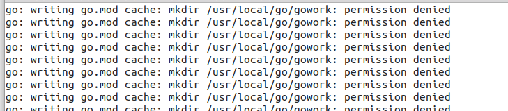

结果出现上图所示的情况,那么我就加了一个sudo试了一下,结果出现了下图所示的情况:

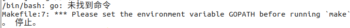

之后做了以下尝试之后很快找到了原因:

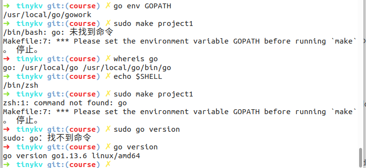

非root用户执行sudo go的时候会出现这种情况...

解决方案: 配置 /etc/sudoers 文件中的 Defaults secure_path 这一项。将 $GOROOT/bin 目录的绝对路径加入进去即可解决。

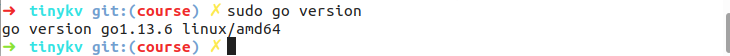

之后就是访问超时...为什么跑个测试都这么难???(黑人问号

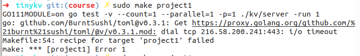

后来我决定还是把GOPATH换一个目录吧,比如主目录下面的go文件夹, 因为主目录下面不需要权限(感觉前面折腾了个寂寞, fff...

然后就好起来了,可以正常的跑测试了,结果也很正常,第一个测试就挂了,毕竟我也没写嘛(笑cry

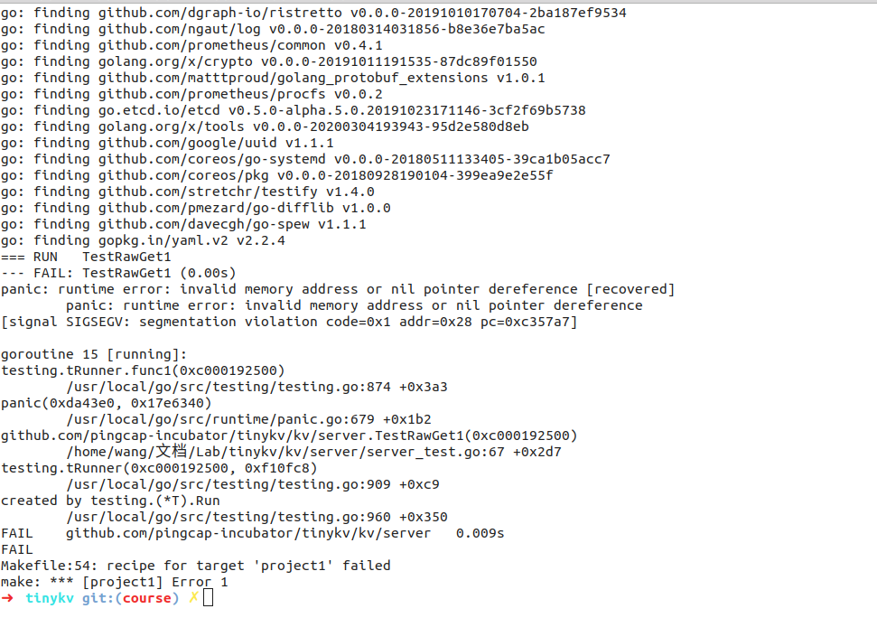

出现上图就代表环境一切正常,可以开始完成需求了!

---

本来准备开始写代码的,但是却发生了一件很郁闷的事情,就是goland里面这种import全部飘红,也就是识别不到导入的这个包

```go
import (
	"github.com/pingcap-incubator/tinykv/kv/config"
	"github.com/pingcap-incubator/tinykv/kv/storage"
	"github.com/pingcap-incubator/tinykv/kv/storage/standalone_storage"
	"github.com/pingcap-incubator/tinykv/kv/util/engine_util"
)
```

我在网上基本没有找到解决的办法,后来我把go mod, gopath, goroot的原理搞清楚了之后终于解决了这个问题,  我在自己尝试的过程中试过把gopath改成当前项目的路径,但是make的时候会报一个错误, `$gopath/go.mod exists but should not`, 也就是gopath不能设置为含有go.mod的目录, 所以我依旧设置为另一个目录了, 后来我观察了一下go.mod的内容,那些包貌似不是我飘红的这些包,于是我在goland里面把go mod关闭了, 然后设置当前项目的gopath为当前项目的路径就解决了这个问题(虽然解决很简单,但是找到这个解决办法还是花了我不少时间,不开森qwq

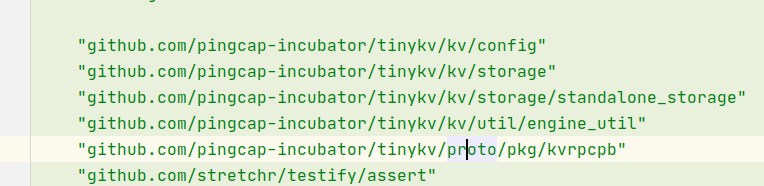

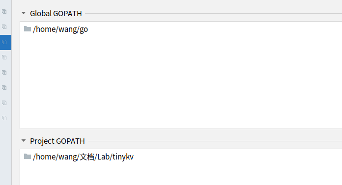


还有一些飘红的处理方法非常简单, alt+enter, 选择蓝色的那个,然后就可以了, 有的可能还需要你选择对应的版本来pull,那就按照提示来就行, git基操不解释

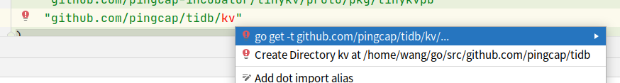

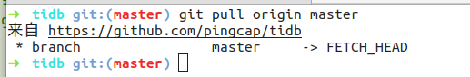

一些外部包就会出现在这里了:


害, 万事开头难, 这个真就开头难, fff...

现在就可以愉快的写代码啦!

---

##### 12/15

之前课实在是太多了,现在终于有一点时间来做这个了,又重新回顾了一下之前的那个问题,这一周我发现没人在群里提及那个问题(import飘红),看来有可能出现这个问题是我哪一步手残导致的,于是决定重新安装一次,后来发现的确是因为我哪里手残了,啥也没改,直接make project1,然后按照go.mod进行安装即可, import也没有飘红

那么下面就开始做题啦

昨天晚上一开始看到指导书之后还是有一些懵的,因为写的有一些简陋,让我不知道到底需要干什么, 不过好在框架代码还蛮好读的,再加上周一开会的时候之前已经做过的同学说主要看engine_util下面的几个文件以及server还是Kv/storage下面的几个文件就可以了, 不过其实我把db以及事物相关的框架代码也读了一下,之后就知道这个实验到底需要我们做什么了

就是对badger的api做一个封装

测试用例里面蕴含的一些提示:

- 当一个键没有找到的时候,err应该为nil而不为ErrKeyNotFound, 同时需要使RawGetResponse的NotFound为true
  - 我遇到的一些问题:我一开始由于是第二个点遇到的这个问题,所以直接把这个判断的逻辑写在了server的RawGet里面, 但是这样会导致TestRawDelete1这个测试用例挂掉,因为测试里面的Get函数是直接调用的reader的GetCF方法,所以绕过了我们的判断条件,解决办法很简单,把判断条件放到reader里面去就可以了, 然后在server的rawget里面只用判断value是否为nil即可

做完留恋一下, 下午争取整理出一份教程出来, 然后写一个循环测试脚本

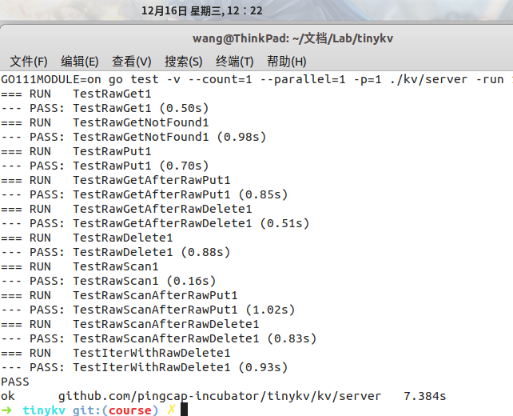


- [ ] #### Project2: RaftKV

##### 20/12/16 开始做project2了

16号其实主要在准备算法实践的汇报, 然后在空闲之余看了一会Raft的论文,但是也没看多少,代码还没开始写

20/12/17

今天上午把报告汇报完之后, 下午就开始写了, 乍一看, 这不就是6824的lab2吗? 而且相比6824的lab2的从白板开始自己构造数据结构的字段, 自己实现所有的函数, 自己设计结构等等, 这个tinykv简直是太良心了, 框架代码给你已经实现了这么多, 甚至状态机都给你构造出来了, 于是开始愉快的撸代码了

大概两个多小时我就已经把基本的框架给撸出来了, 之后运行测试, 发现我的term居然没变? 我当时心中就出现了一堆问号, 后来找到原因了, 我的实现的思路还是按照6824的那样, 但是tinykv必须得通过tick以及step来完成一些操作, 比如超时之后的操作必须在tick里面发送消息到step里面进行处理, 认识到这一点之后, 我又修改了一下自己的代码, 但是还是过不去第一个测试, 后来发现是因为我没有实现处理response的函数, 在6824里面是通过rpc进行通信的, 你发包之后这个函数的返回就是拿到的结果, 但是这个不是这样的, 所以加上这个逻辑之后就能通过第一个测试的逻辑了.

nopStepper就是什么也不干

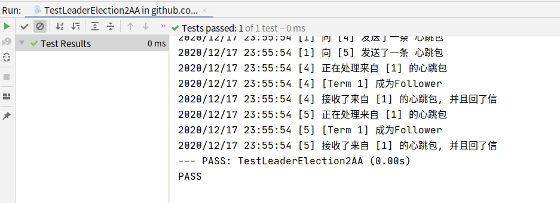

又修补了一下,现在已经能够过一半的点了

20/12/18

今天肝了一个上午,终于把2aa的所有测试点通过了

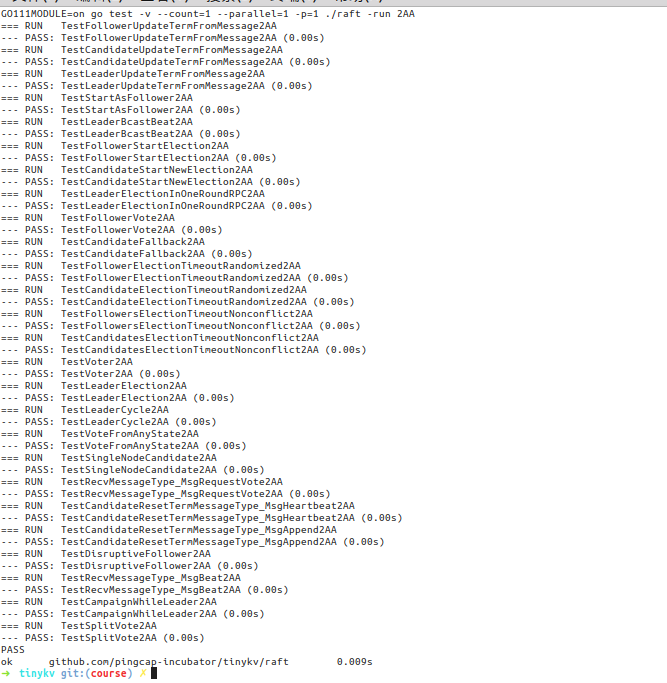